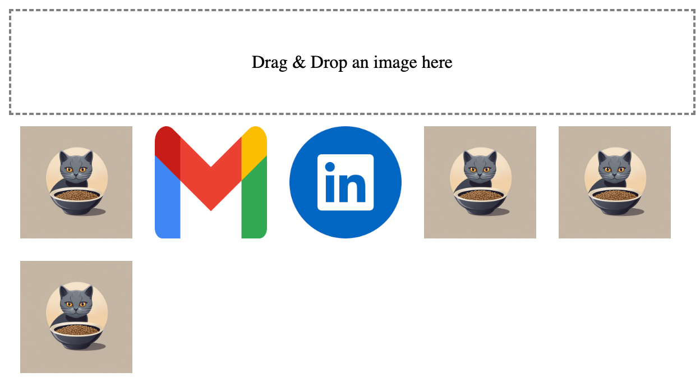

# Drag-Drop

## Overview 
This demonstrates a basic implementation of drag-and-drop functionality on a web page. The goal is to create a user-friendly interface where users can drag and drop images onto a designated target area, and below it will show its thumbnail

## Getting Started

To run this project locally, follow these steps:

1. Clone the repository to your local machine:
   - `git clone https://github.com/abhisheknairSDE/Drag-Drop.git`

2. Navigate to the project directory:
   - `cd Drag-Drop`

3. Run the html page:
